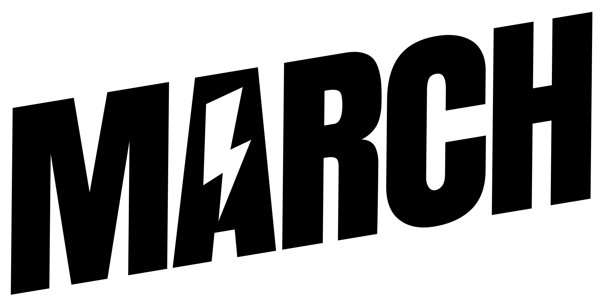
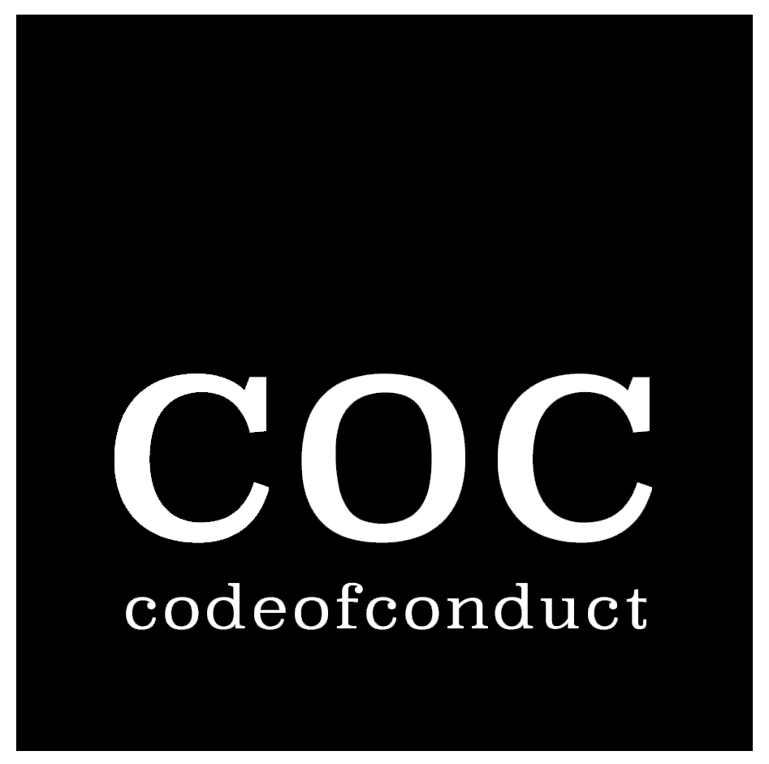
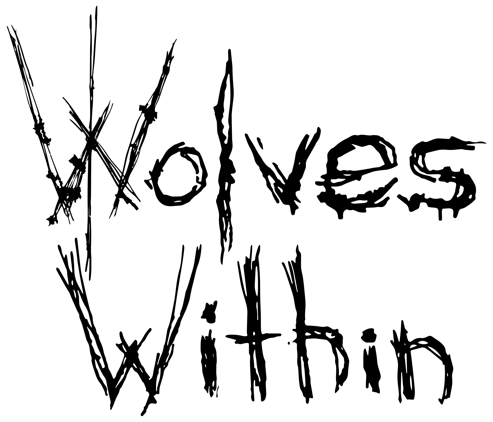
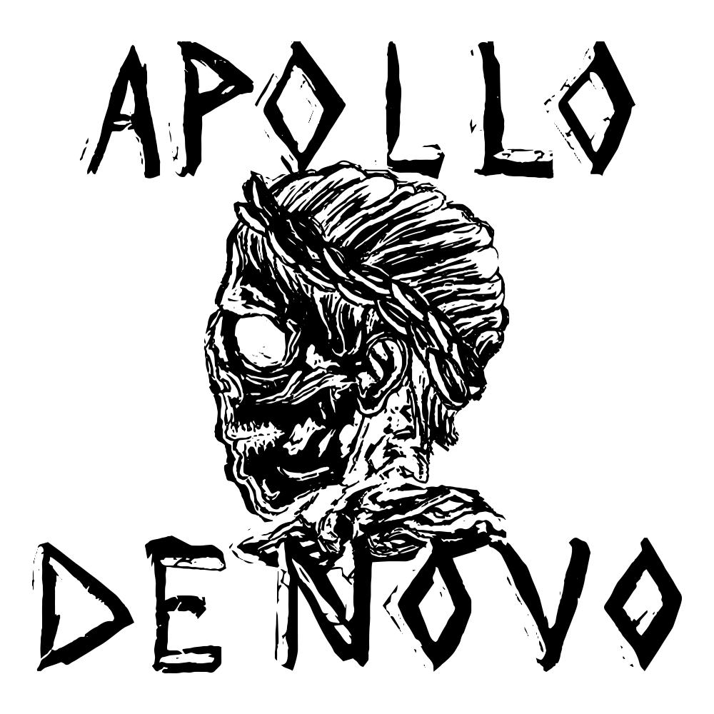

<LineUp title="March" embed="https://www.youtube.com/watch?v=u50vVUj1f_U">
  

  

  Maak kennis met MARCH. Waar je ook fan van bent, je gaat sowieso fan worden van dit Nederlands/Belgische punkrock kwartet. Ze rocken de schroeven uit het podium met de meest intense live show die je gaat meemaken aan deze kant van The Bronx. Agressie? Check. Goede melodie? Check. Absolute fun? Check! It’s simply electrifying!
  

</LineUp>

<LineUp title="Code of Conduct" embed="https://www.youtube.com/watch?v=MfgtqbSfwNI">
  

  

Ergernissen, saaiheid, office romances, practical jokes met collega’s, sex op het kopieerapparaat, je tirannieke baas, een kapotte koffieautomaat, die ass-kissende collega die jouw promotie afpakt, saaie onnodige meetings, etc. Alle aspecten van het alledaagse kantoorleven komen aan bod in een energieke punkrock act met vleugjes van andere genres. How unique!
  

</LineUp>

<LineUp title="Wolves Within" embed="https://www.youtube.com/watch?v=tNDC_y2AOoM">
  

  Wist je dat op een kleine 800 kilometer van het mooie Zwolle af de Zweedse plaats Lund ligt? En dat is niet zomaar een random plaats op de wereld, maar de thuisstad deze intens harde metalband! Drumroll please, want Thunderstruck Festival goes international met niemand minder dan Wolves Within! Deze vier Zweedse diehard (maar dan ook echt diehard) rockers produceren uitgesproken hardcore beats met een moderne touch. Nieuwsgierig naar hoe dat klinkt? Zorg dan dat je hun eerste show op Nederlandse bodem komt aanschouwen tijdens Thunderstruck Festival!
  

</LineUp>

<LineUp title="APOLLO DE NOVO">
    

    

  Kapotte drumstokken die door de lucht vliegen, harde riffs en headbangen. This and more mag je verwachten van deze echte rockers. Ze hebben lak aan flauwekul en prietpraat and they bring the thunder from the left, right, above and down under! Ze breken de tent beestachtig af met alles wat ze in zich hebben. Nog zo'n band die je niet wilt missen!
    

  </LineUp>
