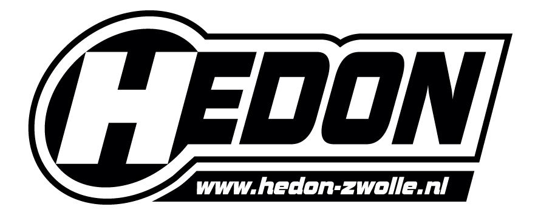

## S.V. Gumbo Millennium

Studentenvereniging Gumbo Millennium is een algemene studentenvereniging gericht op alle informatica studies van Hogeschool Windesheim.

http://www.gumbo-millennium.nl/

## Buro Ruis

Buro Ruis organiseert en ondersteunt wekelijks de meest uiteenlopende culturele activiteiten voor de Zwolse student, zoals leuke feestjes en gave workshops. Ook is Buro Ruis de geoliede machine achter de Zwolse introductieweken voor nieuwe en huidige studenten: de HBO Bruisweek en de MBO Bruisdag.

http://www.buroruis.nl/

## Hedon Zwolle

Bij Hedon kun je als muziekliefhebber wekelijks terecht voor de fijnste concerten en dance-events. Precies hierom is Hedon Zwolle de perfecte locatie voor Thunderstruck Festival.

https://www.hedon-zwolle.nl/

## Gemeente Zwolle

De Gemeente Zwolle vindt het belangrijk om van Zwolle een meer aantrekkelijke studentenstad te maken en heeft daarom een subsidieregeling opgezet. Vanuit de subsidiepot Voor studenten door studenten draagt de Gemeente Zwolle bij aan de realisatie van Thunderstruck Festival.

https://www.zwolle.nl/

## Jack´s Music Bar

Jack’s Music Bar Met elk weekend live muziek, van ska tot blues en van rock tot metal, is Jack’s Music Bar een onmisbaar muziekcafé in Zwolle en omstreken. We zijn dan ook erg blij Jack’s onze nieuwe partner te mogen noemen. Jack’s Music Bar verzorgt de officiële Thunderstruck Festival afterparty.
http://www.jacksmusicbar.com/

## Strik Beats

Strik Beats is een oefenruimtecomplex in Zwolle dat faciliteiten biedt aan muzikanten en bands met de juiste sfeer, comfort en professionaliteit. Rick Strik is al tijden een gewaardeerde sparpartner voor de organisatie van Thunderstruck Festival.\

http://www.strikbeats.com/
